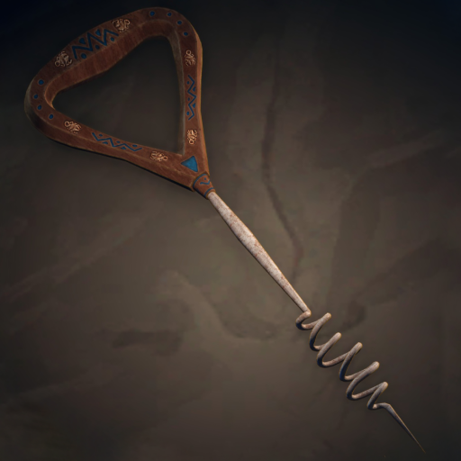

# They Stole Max's Brain !

**This mod adds an easy way** on your server or single player world to **disable the AI of a mob**, so it **stops moving** and can, for example, **die inside a wall**.

To use it, you only need to **apply a name tag** labeled **"Brain Screw"** to a mob. After that, **the mob will stop moving** completely.

**Note:** The **"Brain Screw"** is **not recommended** for creatures **younger than 6 months** or for **squids out of water**. Please consult your **nearest toolsmith** for possible side effects.

***"Image for illustrative purposes only"***
